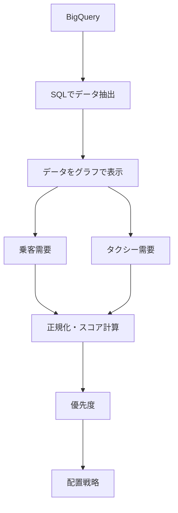

# NYC Taxi Data Analysis

## 概要
NYC Taxi Dataを使用して、地域ごとの需要・ピーク時間帯・時間帯による需要変化を分析し、車両配置戦略を検討するプロジェクト。

## 目的
地域・時間帯ごとの需要変化を分析し、ピーク時の車両配置戦略を検討する。


## 学習目的
BigQueryからSQLでデータを抽出し、SQL言語の習得とともに、Pythonによるデータ可視化・データの分析の実践経験を積む。

## 使用データ
Dataset:
bigquery-public-data.new_york_taxi_trips.tlc_yellow_trips_2022


## 分析内容
analysis_01.py
→ 年間のトリップ数が10万回以上ある曜日ごと・時間ごとの需要の集中データを抽出し、最もタクシーの利用が多い曜日と時間を分析。

analysis_02.py
→ 金曜日・19時の最もタクシーの利用が多かった地域を抽出し、散布図から関係性を分析。

analysis_03.py
→ analysis_01.pyとanalysis_02.pyの結果から上位の5地域を抽出し、ピーク時の時間帯の車両の配置を分析。


## 分析結果
タクシーの利用回数と乗客の需要の相関係数は約0.993であり、非常に強い正の相関関係が見られた。
タクシーの利用回数と一度の利用に対する乗客の需要の相関係数は約-0.126であり、ほぼ相関関係は見られなかった。
需要は15時～19時に集中しており、ピークを19時に迎え、20時から大幅な減少が確認された。
需要の多い曜日は、水曜日・金曜日・土曜日で、最大は金曜日だと確認できた。
金曜日19時のピーク需要・年間トリップ数・需要優先度・17時～18時のトリップ数と需要増加率から「170・186・68・107・141」の5地域を分析対象に絞り車両配置の優先度を評価した。

## 車両配置戦略
|地域ID | 17時 | 18時 | 19時 | 20時 | 21時 |
|---|---|---|---|---|---|
| 170 | 配置強化 | 配置強化 | ピーク | 減車 | 減車 |
| 186 | 配置強化 | 配置強化 | ピーク | 減車 | 減車 |
| 107 | 配置強化 | 配置強化 | ピーク | 減車 | 減車 |
| 68 | 配置強化 | 配置強化 | ピーク | 減車 | 減車 |
| 141 | 配置強化 | 配置強化 | 減車 | 減車 | 減車 |

## 分析から得られた知見
- 170・186：
  需要が高いため、ピークに向けた車両確保を優先

- 107：
  ピーク前から需要が増加するため、早めに配置強化

- 68：
  需要増加を考慮し、状況に応じて配置

- 141：
  19時から需要が減少するため、19時から減車を検討

- その他：
  20時以降の需要減少を考慮して減車を検討

## 使用技術
### Language
- Python
- SQL

### Libraries
- pandas
- Numpy
- Matplotlib

### Data Warehouse
- Google BigQuery


## プロジェクト構成
```text
NYC Taxi Data Analysis/
├── .gitignore
├── README.md
├── requirements.txt
|
├── python/
|    ├── analysis_01.py          # 需要の多い曜日・時間を分析
|    ├── analysis_02.py          # ピーク時の地域別需要を分析
|    ├── analysis_03.py          # 上位地域の車両配置戦略を分析
|    │
|    ├── analysis_utils.py       # 分析・統計計算用の関数
|    ├── data_utils.py           # データ取得・前処理用の関数
|    ├── output_utils.py         # 分析結果の出力用の関数
|    ├── plot_utils.py           # グラフ描画用の関数
|    └── strategy_utils.py       # 車両配置戦略の計算用の関数
|
└── sql/
    ├── 01_basic_analysis.sql       # 需要の多い曜日・時間を抽出
    ├── 02_peak_demand_analysis.sql # ピーク時の需要の多い地域を抽出
    └── 03_time_series_analysis.sql # 地域・曜日・時間別のデータを抽出




## 実行方法


### 1. リポジトリをクローン
```powershell
git clone https://github.com/syuhei-hiraoka/nyc-taxi-data-analysis.git
cd nyc-taxi-data-analysis
```
### 2. 仮想環境を作成
```powershell
python -m venv python/.venv
python/.venv/Scripts/Activate.ps1
```

### 3. 必要なライブラリをインストール
```powershell
pip install -r requirements.txt
```

### 4. Google Cloudの認証

Application Default Credentialsを設定します。

```powershell
gcloud auth application-default login
```

### 5. Pythonファイルを実行
プロジェクトのルートディレクトリから以下のコマンドを実行します。

```powershell
python python/analysis_01.py
python python/analysis_02.py
python python/analysis_03.py
```

## 今後の改善
- 地域の実際の地理を含めた分析
- より高度な予測モデルの導入