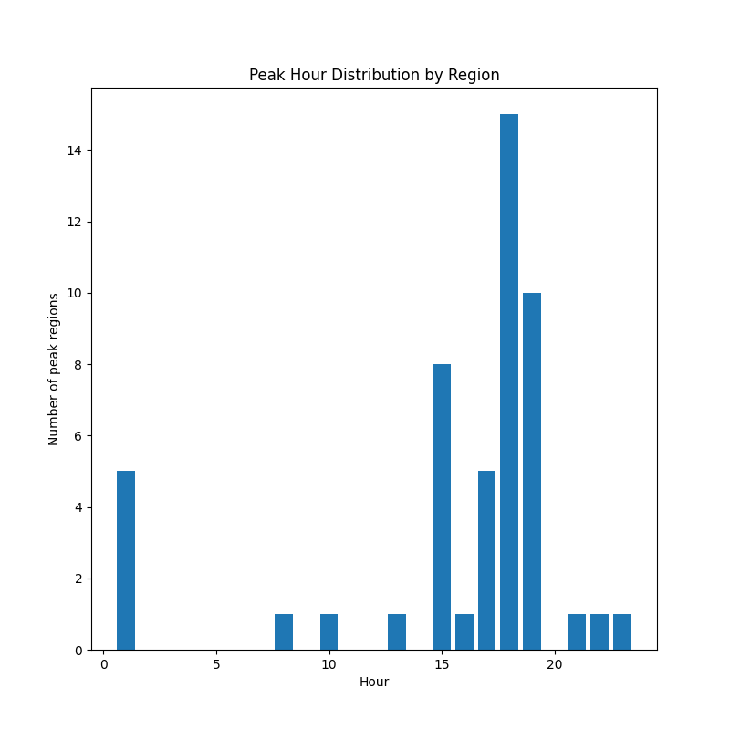
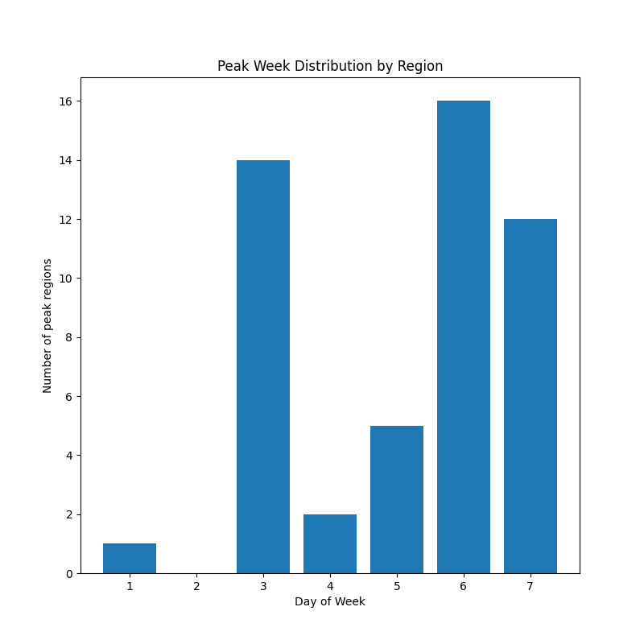
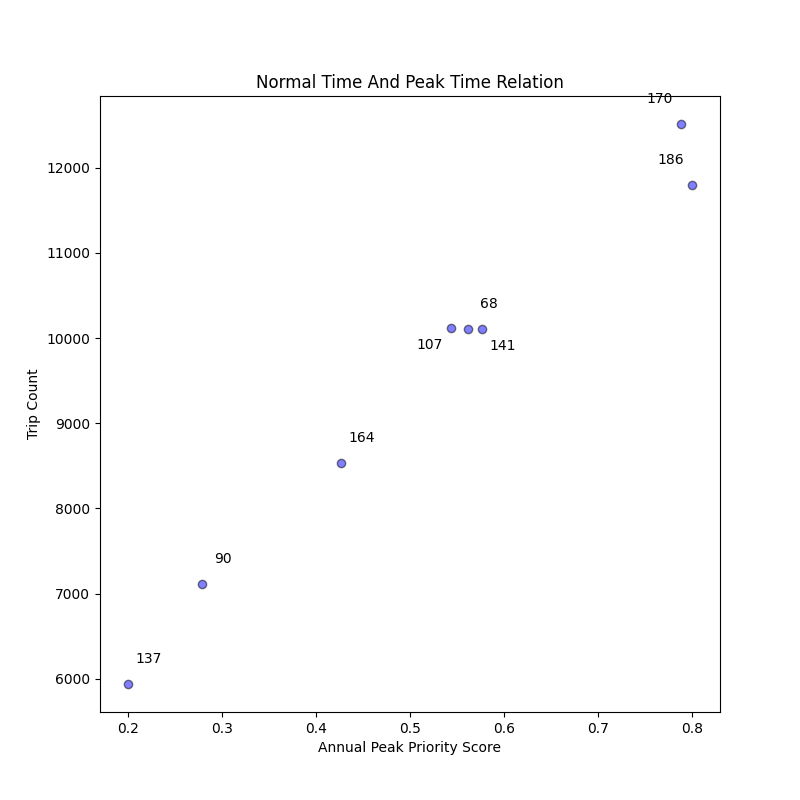
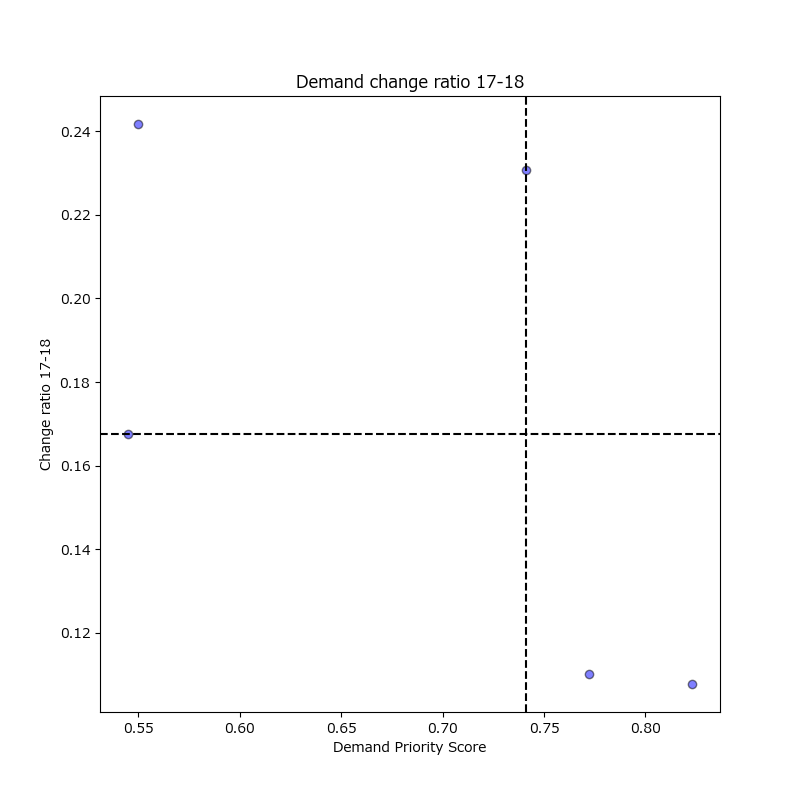
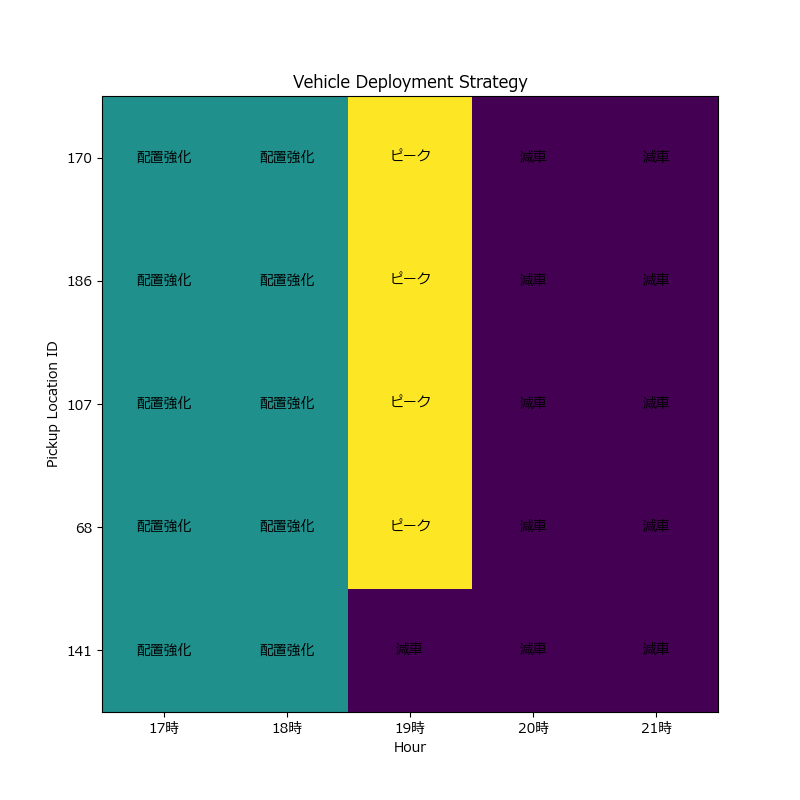
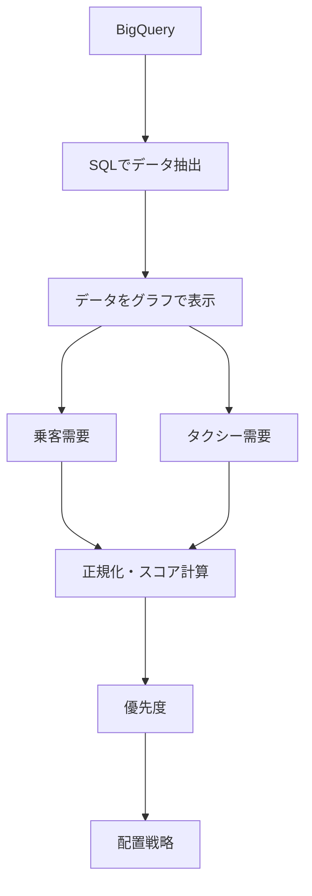

# NYC Taxi Data Analysis

## 概要
NYC Taxi Dataを使用して、地域ごとの需要・ピーク時間帯・時間帯による需要変化を分析し、車両配置戦略を提案したプロジェクト。


## 目的
地域・時間帯ごとの需要変化を分析し、ピーク時の車両配置戦略を提案した。


## 学習目的
BigQueryからSQLでデータを抽出し、SQL言語の習得とともに、Pythonによるデータ可視化・データの分析の実践経験を積む。


## 使用データ
Dataset:
bigquery-public-data.new_york_taxi_trips.tlc_yellow_trips_2022


## 分析内容
analysis_01.py
→ 年間のトリップ数が10万回以上ある曜日ごと・時間ごとの需要の集中データを抽出し、最もタクシーの利用が多い曜日と時間を分析。

analysis_02.py
→ 金曜日・19時の最もタクシーの利用が多かった地域を抽出し、散布図から関係性を分析。

analysis_03.py
→ analysis_01.pyとanalysis_02.pyの結果から上位の5地域を抽出し、ピーク時の時間帯の車両の配置を分析。


## 分析結果
- タクシーの利用回数と乗客の需要の相関係数は約0.993であり、非常に強い正の相関関係が見られた。
- トリップ数と1回あたりの平均乗客数の需要の相関係数は約-0.126であり、明確な線形関係は確認できなかった。
- 15時～19時に需要が集中し、19時にピークを迎えた。特に19時から20時にかけて需要が大きく減少する傾向が確認された。この結果から、車両配置は19時のピークに合わせて増車するだけでなく、20時以降の需要減少を考慮して減車する必要があると考えた。
- ピーク時間帯となった地域数は水曜日・金曜日・土曜日に多く、特に金曜日が最も多かった。


## 分析の流れ

1. BigQueryから2022年のNYC Taxiデータを取得
2. 曜日・時間帯別の需要を分析
3. 金曜日19時を全体のピーク時間として特定
4. ピーク時の地域別需要を分析
5. 年間利用規模とピーク集中度から候補地域を選定
6. ピーク前の需要増加率を分析
7. 需要優先度と需要変化から車両配置戦略を提案


## 分析対象地域の選定
analysis_01.pyで特定した「金曜日19時」を基準として、
analysis_02.pyでピーク時の地域別需要を分析し、
年間利用規模とピーク集中度から候補地域を絞り込んだ。
その後、analysis_03.pyでピーク前の需要増加率を分析し、
最終的に以下の5地域を分析対象とした。

170、186、68、107、141






### ピーク地域選定スコア
- 年間の利用規模とピーク需要の集中度を組み合わせ、
分析対象地域の候補を比較するためのスコアを算出した。
  - full_trip_count：年間の総需要
  - peak_concentration：年間の総需要でピークの需要がどのくらいの割合を占めているか

- 年間ピーク需要優先度スコア =
full_trip_norm × 0.8
+ peak_conc_norm × 0.2

- 70:30、80:20など複数の重みを比較した結果、ピーク集中度の重みを大きくすると地域の順位に変化が生じた。そのため、80:20を採用することで、年間利用規模を重視し、一時的なピーク集中度だけで地域が上位になることを避けた。


### 需要優先度スコア
- 地域ごとの需要特性を比較するため、以下の3つの指標を使用した。
  - trip_count：タクシーの利用回数
  - passenger_demand：乗車した乗客の総数
  - avg_passenger_count：1回の利用あたりの平均乗客数

- trip_count と passenger_demand には強い正の相関（r=0.966）が確認された。一方、 avg_passenger_count はこれらとは異なる傾向を示した。

- そのため、利用回数や総乗客数だけではなく、1回あたりの利用人数という異なる需要特性も考慮するため、avg_passenger_count を評価指標に加えた。

- 各指標は値のスケールが異なるため、Min-Max正規化によって0～1の範囲に変換したうえで重み付けし,
需要優先度スコアを算出した。

- 需要優先度スコア =
trip_count × 0.5
+ passenger_demand × 0.3
+ avg_passenger_count × 0.2

- 50:30:20、40:40:20、60:20:20の3パターンで
重みを変更して感度分析を行った。

その結果、今回の5地域では重みを変更しても順位に変化がなかった。

また、trip_countとpassenger_demandには強い正の相関（r=0.966）が確認されたため、
両者は類似した情報を持つと考えられる。

一方、avg_passenger_countは異なる傾向を示したため、
地域の基本的な需要規模をtrip_countで評価し、
passenger_demandとavg_passenger_countを補助的な指標として加える
50:30:20の重みを最終的に採用した。




## 車両配置戦略
|地域ID | 17時 | 18時 | 19時 | 20時 | 21時 |
|---|---|---|---|---|---|
| 170 | 配置強化 | 配置強化 | ピーク | 減車 | 減車 |
| 186 | 配置強化 | 配置強化 | ピーク | 減車 | 減車 |
| 107 | 配置強化 | 配置強化 | ピーク | 減車 | 減車 |
| 68 | 配置強化 | 配置強化 | ピーク | 減車 | 減車 |
| 141 | 配置強化 | 配置強化 | 減車 | 減車 | 減車 |




## 分析から得られた知見
- 170・186：
  需要が高いため、ピークに向けた車両確保を優先

- 107：
  ピーク前の需要増加が大きいため、17時～18時から配置を強化

- 68：
  需要規模とピーク前の増加率を考慮し、17時～18時から配置を強化

- 141：
  19時から需要が減少するため、19時から減車を検討

- その他：
  20時以降の需要減少を考慮して減車を検討

- ただし、本分析では実際の車両台数・移動時間・待ち時間・道路混雑などを考慮していないため、実運用ではこれらを加味する必要がある。


### 分析のまとめ

本分析では、地域ごとの需要規模だけでなく、
ピーク前の需要増加率とピーク後の需要減少タイミングを組み合わせることで、
地域ごとに異なる車両配置戦略を検討した。

その結果、単純に需要の多い地域へ車両を集中させるのではなく、
「需要規模」「需要の増加」「需要の減少」の3つの観点から
配置強化・ピーク・減車のタイミングを検討できることを確認した。


## 使用技術
### Language
- Python
- SQL

### Libraries
- pandas
- Numpy
- Matplotlib

### Data Warehouse
- Google BigQuery


## プロジェクト構成
```text
NYC Taxi Data Analysis/
├── .gitignore
├── README.md
├── requirements.txt
|
├── python/
|    ├── analysis_01.py          # 需要の多い曜日・時間を分析
|    ├── analysis_02.py          # ピーク時の地域別需要を分析
|    ├── analysis_03.py          # 上位地域の車両配置戦略を分析
|    │
|    ├── analysis_utils.py       # 分析・統計計算用の関数
|    ├── data_utils.py           # データ取得・前処理用の関数
|    ├── output_utils.py         # 分析結果の出力用の関数
|    ├── plot_utils.py           # グラフ描画用の関数
|    └── strategy_utils.py       # 車両配置戦略の計算用の関数
|
└── sql/
    ├── 01_basic_analysis.sql       # 需要の多い曜日・時間を抽出
    ├── 02_peak_demand_analysis.sql # ピーク時の需要の多い地域を抽出
    └── 03_time_series_analysis.sql # 地域・曜日・時間別のデータを抽出
```




## 実行方法


### 1. リポジトリをクローン
```powershell
git clone https://github.com/syuhei-hiraoka/nyc-taxi-data-analysis.git
cd nyc-taxi-data-analysis
```
### 2. 仮想環境を作成
```powershell
python -m venv python/.venv
python/.venv/Scripts/Activate.ps1
```

### 3. 必要なライブラリをインストール
```powershell
pip install -r requirements.txt
```

### 4. Google Cloudの認証

Application Default Credentialsを設定します。

```powershell
gcloud auth application-default login
```

### 5. Pythonファイルを実行
プロジェクトのルートディレクトリから以下のコマンドを実行します。

```powershell
python python/analysis_01.py
python python/analysis_02.py
python python/analysis_03.py
```


## 今後の改善
- NYCの地理情報と組み合わせ、地域ごとの需要分布を地図上で可視化
- 天候・祝日・イベントなどの外部要因を追加
- 時系列予測モデルを導入し、将来の需要を予測
- 実際の車両台数や移動時間を考慮した配置最適化